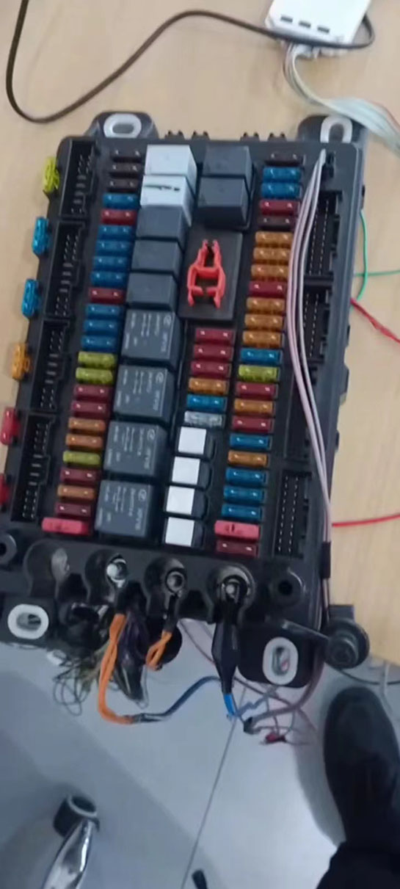

# 项目经历

## 宇通项目

智能电器盒 

应用在校车上面如下图

### 功能说明

- **基本功能**：

  电源分配(30电、15电、各种车身用电)，雨刮控制（间歇、高速、低速），车身灯光控制（大灯、小灯、危险报警、指示臂灯）。

- **OTA 升级** 

  TBOX连接支持OTA升级。

- **CAN转发**

  支持最大6路CAN网络之间的报文转发
  
- **故障诊断**

  具有输入、输出、CAN通信故障诊断功能。
  
  

## 职责

在项目当中担任过主程开发，项目负责人，技术负责人，负责了前期项目沟通，功能开发、自测、整车调试、已平台化量产，适配各种车型。如对我公司产品感兴趣可直接联系我。

## 陕汽项目

